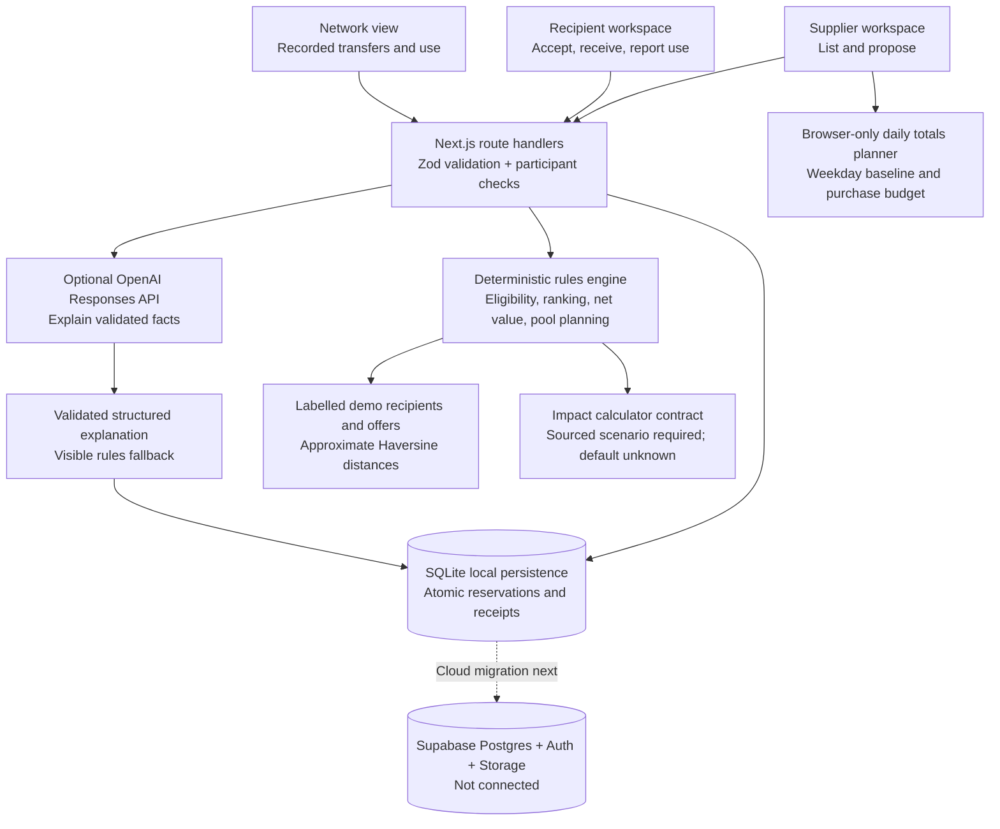
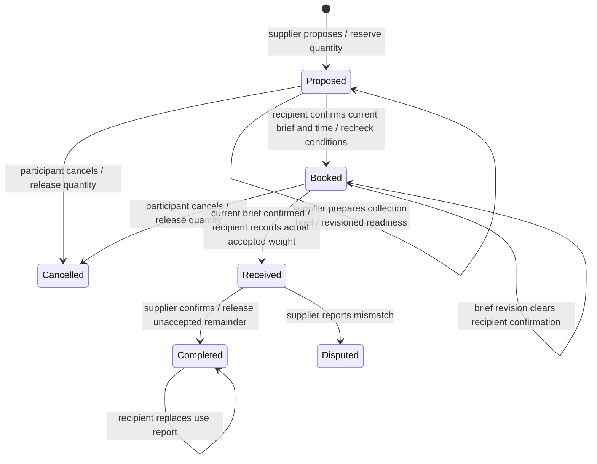

# Nile architecture — build v0.1

The supplier, recipient and network views share one Next.js application. Server routes validate input with Zod and enforce participant roles before changing a handover. The local workspace makes demo role switching explicit.

An independent `src/lib/climate-scenario.ts` calculator powers the opening Australia illustration. It uses sourced generic food-waste proxies, user-selected scale and gas capture; it never supplies a factor to the recorded-transfer engine. It also calculates a separate café outreach target from a dated industry estimate; target businesses are never treated as actual contacts or used to infer diverted waste. `src/components/coffee-metrics.tsx` separates these projections from **Our records**, exposes assumptions and sources, and provides a 1–10% slider in 0.5% steps. The opening shows tonnes of waste and methane, with no duplicate GHG-reduction card. See [the climate method](climate-scenario.md).

## Module ownership

| Module                           | Responsibility                                                                                                       |
| -------------------------------- | -------------------------------------------------------------------------------------------------------------------- |
| `src/lib/domain.ts`              | Schemas, evidence states, shared types and display formatting                                                        |
| `src/lib/engine.ts`              | Hard eligibility gates, ranking, costs, compatible pool suggestions, recorded metrics and bounded impact calculation |
| `src/lib/store.ts`               | SQLite transactions, stock allocation and participant/state transition enforcement                                   |
| `src/lib/server.ts`              | Demo session allowlist, local Host/Origin checks and safe API errors                                                 |
| `src/lib/ai.ts`                  | Optional server-only OpenAI explanation; no authority over calculations or bookings                                  |
| `src/lib/explanation-service.ts` | Current match validation, answer cache, concurrent-call deduplication and saved explanation orchestration            |
| `src/lib/matching.ts`            | Shared browsing/explanation calculation using current unallocated recipient capacity                                 |
| `src/lib/ai-record.ts`           | Serializable explanation and backend status contracts; no server SDK imported by the browser                         |
| `src/lib/fixtures.ts`            | Explicitly invented sample businesses, requirements, quotes and starting batches                                     |
| `src/app/api/`                   | Request validation and orchestration                                                                                 |
| `src/components/`                | Supplier, recipient, network views, listing form and match/receipt panels                                            |

## Transfer state machine

Disputed receipts remain reserved and excluded from completed metrics. Dispute resolution is not implemented in v0.1. A received weight cannot exceed its agreement, and use cannot exceed accepted weight. AI output cannot create a transition. Every reservation is revalidated inside a SQLite `BEGIN IMMEDIATE` transaction, so stale browser recommendations cannot allocate stock twice.

## Ranking contract

Material acceptance and condition are hard gates. Freshness, minimum quantity, capacity, packaging and timing must fit. Prospects are separately labelled and unbookable. Compatible options can be ranked by net value per kilogram, approximate distance, or a stated balanced heuristic. The balanced heuristic uses `net AUD/kg − 0.15 × approximate km`; it is a demo preference, not a learned probability or calibrated confidence score.

The engine does not infer a material's measured weight, certify food safety or predict an unsupported price. Recipients' sample freshness rules must be replaced by recipient-specific validated requirements for a pilot.

## Migration boundary

The Supabase migration prepares organizations, memberships, recipients, listings, transfers and explanation records. All tables have RLS enabled, authenticated reads are scoped, and direct client writes are denied. Membership is administrator-provisioned. Policy tests execute the actual SQL in PGlite with simulated Auth subjects; hosted Auth/JWT/PostgREST remain unverified.

Supabase sessions, a cloud repository, photo uploads, business discovery and road routing remain planned adapters. A cloud implementation must move reservations and receipt transitions into locking database transactions/RPCs and verify organization access using real accounts. Client code must never receive a database service role key or `OPENAI_API_KEY`. See [backend setup](backend-setup.md).

## Explanation request path

`POST /api/explain` checks local JSON/Origin rules and supplier ownership, then recalculates eligibility using current stock and recipient capacity. A SHA-256 key includes those facts and the configured model. Identical successful answers are cached for five minutes; concurrent identical calls share one promise within the local process. The persisted daily cap counts outbound attempts, including provider failures.

The adapter requests a completed Zod-validated Responses API result with no mutating tools, `store: false`, bounded output, a 12-second timeout and no retries. It saves successful and fallback answers with an addressable ID; provider model, response ID and actual token usage are saved when returned with a valid answer. `GET /api/explanations/{id}` restricts access to the owning demo supplier. `GET /api/health` reads configuration and the allowance without calling OpenAI. A key's presence alone does not verify model access.

The emissions calculator accepts only an explicitly bounded, sourced scenario. The demo supplies no climate factor. Reference sources for later factor validation include [National Greenhouse Accounts factors](https://www.dcceew.gov.au/climate-change/publications/national-greenhouse-accounts-factors-2026) and relevant [EPA Victoria guidance](https://www.epa.vic.gov.au/waste-levy); source availability alone does not establish the correct treatment factor.
